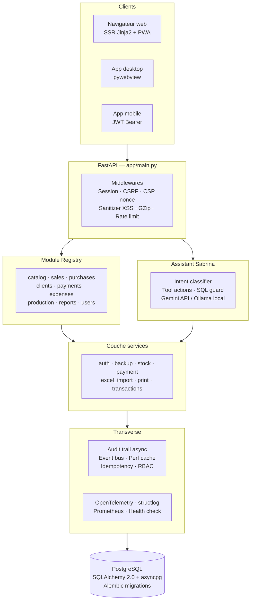

# FABOuanes

**FABOuanes** est une solution de gestion commerciale et de bureau pensée pour la facturation, le suivi client, l'inventaire, la production et l'assistance métier. Le projet combine une application **FastAPI**, une interface web moderne (rendu serveur + PWA offline) et un assistant IA nommé **Sabrina** pour accompagner les utilisateurs dans leurs tâches quotidiennes.


---

## Sommaire

- [Fonctionnalités principales](#fonctionnalités-principales)
- [Architecture](#architecture)
- [Stack technique](#stack-technique)
- [Démarrage rapide](#démarrage-rapide)
- [Configuration](#configuration)
- [Structure du projet](#structure-du-projet)
- [Modules métier](#modules-métier)
- [Tests](#tests)
- [Déploiement](#déploiement)
- [Observabilité](#observabilité)
- [Sécurité](#sécurité)
- [Contribuer](#contribuer)
- [Changelog](#changelog)

---

## Fonctionnalités principales

- **Gestion commerciale et facturation** — ventes, achats, production, catalogue
- **Suivi des clients, fournisseurs et opérations** avec historique complet
- **Assistant Sabrina** intégré, capable d'exécuter des actions métier via langage naturel (Gemini ou Ollama en local)
- **Interface web et bureau** : rendu serveur (Jinja2), PWA installable avec mode hors-ligne, application desktop via `pywebview`
- **API mobile** dédiée (JWT) pour une application vendeur terrain
- **Tableaux de bord et rapports** avec KPI, alertes et export PDF
- **Sauvegardes automatiques**, audit trail complet, cache haute performance
- **Déploiement local ou conteneurisé** (Docker Compose)

---

## Architecture

FABOuanes suit une architecture modulaire à couches, avec découverte automatique des modules métier au démarrage.



**Principes clés :**

- **Modules auto-découverts** : chaque domaine métier (`app/modules/<nom>/`) s'enregistre lui-même via `ModuleDescriptor` ; ajouter un module ne nécessite aucune modification du core.
- **Un seul worker applicatif** : le cache et le scheduler sont in-process ; la coordination multi-instance passe par une table `pubsub_events` PostgreSQL (voir [Limitations connues](#limitations-connues)).
- **Séparation web/API** : les routes HTML (`app/web/`) et les routes JSON (`app/api/v1/`) partagent les mêmes services métier.

---

## Stack technique

| Domaine | Technologies |
|---|---|
| Backend | FastAPI, SQLAlchemy 2.0, asyncpg, pg8000, Alembic |
| Frontend | Jinja2, Bootstrap, JS modulaire (vanilla), Chart.js |
| Base de données | PostgreSQL 16 |
| Assistant IA | Google Gemini API, Ollama (modèles locaux) |
| Sécurité | JWT (PyJWT), CSRF, CSP, rate limiting (slowapi), RBAC |
| Observabilité | OpenTelemetry, structlog, Prometheus |
| Desktop | pywebview |
| PWA | Service Worker, IndexedDB (mode hors-ligne) |
| Conteneurisation | Docker multi-stage, Docker Compose |
| CI/CD | GitHub Actions (lint ruff/mypy, tests pytest + coverage) |

---

## Démarrage rapide

### Prérequis

- Python 3.11+
- PostgreSQL 16 (local ou via Docker)
- Docker Compose (optionnel, recommandé pour un environnement reproductible)

### Installation locale

```powershell
# 1. Cloner le dépôt
git clone https://github.com/ouanesfab-alt/FABouanes.git
cd FABouanes

# 2. Créer et activer l'environnement virtuel
python -m venv .venv
.venv\Scripts\Activate.ps1

# 3. Installer les dépendances
python -m pip install -r requirements.txt

# 4. Configurer l'environnement
copy .env.example .env
# Éditer .env : définir DATABASE_URL, SECRET_KEY, DEFAULT_ADMIN_PASSWORD

# 5. Lancer l'application (les migrations s'appliquent automatiquement au démarrage)
python -m uvicorn app.main:app --host 0.0.0.0 --port 5000 --reload
```

L'application est accessible sur `http://localhost:5000`. Le compte admin par défaut est créé au premier lancement (voir `.env` pour les identifiants).

### Lancement bureau

```powershell
python launcher.py
```

### Avec Docker Compose

```powershell
# Copier et configurer les variables d'environnement
copy .env.example .env

# Démarrer (base de données + application + pgAdmin)
docker compose up --build
```

Services démarrés :
- `web` — application FastAPI sur le port `5000`
- `db` — PostgreSQL 16 sur le port `5432`
- `pgadmin` — interface d'administration PostgreSQL

### Vérifier que tout fonctionne

```bash
curl http://localhost:5000/health
```

Une réponse `{"status": "ok", ...}` confirme que la base de données, le scheduler et le cache sont opérationnels.

---

## Configuration

Toutes les variables sont documentées dans `.env.example`. Les plus importantes :

| Variable | Rôle | Défaut |
|---|---|---|
| `SECRET_KEY` | Clé de session — **obligatoire en production** | auto-générée si vide |
| `DATABASE_URL` | Connexion PostgreSQL (`postgresql://...`) | — |
| `FAB_PASSWORD_MODE` | `0000` (4 chiffres) ou `password` (8+ car.) | `0000` |
| `SESSION_COOKIE_SECURE` | Cookies HTTPS-only | `0` (auto en production) |
| `FAB_MODULES_DISABLED` | Désactiver des modules (`expenses,reports`) | — |
| `WEB_CONCURRENCY` | Nombre de workers uvicorn | `1` (voir limitations) |
| `FAB_RATE_LIMIT_BACKEND` | `memory` ou `db` | `memory` |

> **Recommandation production** : passez `FAB_PASSWORD_MODE=password` dès qu'un accès réseau ou multi-utilisateur est activé — le mode `pin` (4 chiffres) est réservé à un usage desktop strictement local.

---

## Structure du projet

```
FABouanes/
├── app/
│   ├── api/            # Routes API REST (JSON) — /api/v1/*
│   ├── core/            # Config, DB, cache, sécurité, audit, event bus
│   ├── modules/          # Modules métier auto-découverts
│   │   ├── assistant/    # Assistant Sabrina (IA)
│   │   ├── catalog/      # Catalogue produits
│   │   ├── clients/      # Gestion clients
│   │   ├── expenses/     # Dépenses
│   │   ├── payments/     # Paiements
│   │   ├── production/   # Production
│   │   ├── purchases/    # Achats
│   │   ├── reports/      # Rapports & dashboards
│   │   ├── sales/        # Ventes
│   │   └── users/        # Utilisateurs & rôles
│   ├── services/         # Services transverses (auth, backup, stock...)
│   └── web/              # Routes HTML (rendu serveur)
├── alembic/              # Migrations de base de données
├── templates/            # Vues Jinja2
├── static/               # CSS, JS, assets, PWA (manifest, service worker)
├── tests/                # Tests automatisés (pytest)
├── deploy/               # Fichiers de déploiement (Docker)
├── installer/            # Scripts d'installation Windows
└── scripts/              # Scripts utilitaires
```

---

## Modules métier

| Module | Rôle |
|---|---|
| `assistant` | Assistant IA Sabrina — classification d'intention, actions outillées, garde-fou SQL |
| `catalog` | Gestion du catalogue produits et matières premières |
| `clients` | Fiches clients, historique, import en masse |
| `expenses` | Suivi des dépenses |
| `payments` | Paiements clients/fournisseurs |
| `production` | Suivi de production et recettes |
| `purchases` | Achats fournisseurs |
| `reports` | Tableaux de bord, KPI, alertes |
| `sales` | Ventes et facturation |
| `users` | Utilisateurs, rôles et permissions (RBAC) |

Chaque module déclare ses routes web/API, son schéma SQL et ses permissions via `ModuleDescriptor` — voir `app/core/registry.py` pour le mécanisme d'enregistrement.

---

## Tests

```bash
# Lancer la suite de tests avec couverture
python -m pytest --cov=app --cov-report=term-missing

# Lancer uniquement les tests de services avec le seuil de couverture strict (80%)
python -m pytest --cov=app --cov-config=tests/pyproject_services.toml --cov-fail-under=80
```

> **État actuel** : le seuil de couverture appliqué en CI est de 20 % (`--cov-fail-under=20` dans `.github/workflows/ci.yml`). Un seuil plus strict (80 %) existe pour les services métier critiques (`tests/pyproject_services.toml`) mais n'est pas encore appliqué en continu — objectif à court terme.

---

## Déploiement

### Image Docker

L'image est construite en deux étapes (builder + production), tourne avec un utilisateur non-root, et embarque un healthcheck :

```bash
docker build -t fabouanes:latest .
docker run -p 5000:5000 --env-file .env fabouanes:latest
```

### Limitations connues

- **Un seul worker applicatif recommandé** (`WEB_CONCURRENCY=1`) : le cache et le scheduler de sauvegarde sont in-process. Le multi-worker peut être activé explicitement (`FAB_ALLOW_MULTI_WORKER=1`) ; la cohérence inter-workers passe alors par une table `pubsub_events` avec une latence de propagation d'environ 1 seconde.
- PostgreSQL est le seul moteur de base de données supporté (validation stricte de `DATABASE_URL`).

---

## Observabilité

- **Métriques** : exposées au format Prometheus sur `/metrics` (instrumentées via `prometheus-fastapi-instrumentator`)
- **Traces** : OpenTelemetry, exportables vers un collecteur OTLP (`OTEL_EXPORTER_OTLP_ENDPOINT`)
- **Logs** : format JSON structuré en production (`FAB_LOG_JSON=1`), texte lisible en développement
- **Health check** : `/health` et `/readiness` — vérifient la base de données, le scheduler de sauvegarde, l'espace disque et le cache

---

## Sécurité

- Sessions signées (`itsdangerous`) avec cookie `SameSite=Lax`, HTTPS-only forcé en production
- Protection CSRF sur tous les formulaires, nonce CSP par requête
- Sanitisation XSS automatique des champs de formulaire (middleware transverse)
- RBAC à trois rôles (`admin`, `manager`, `operator`) avec permissions déclaratives par endpoint
- Authentification JWT dédiée pour l'API mobile
- Rate limiting configurable (mémoire ou base de données)
- Piste d'audit asynchrone (qui a fait quoi, quand, avant/après)

Pour signaler une vulnérabilité, contactez l'équipe via le dépôt GitHub plutôt que d'ouvrir une issue publique.

---

## Contribuer

1. Créez une branche depuis `main` : `git checkout -b feature/ma-fonctionnalite`
2. Respectez le style existant (`ruff check app/`, `mypy app/`)
3. Ajoutez des tests pour toute nouvelle logique métier
4. Vérifiez que la suite complète passe : `pytest --cov=app`
5. Ouvrez une pull request avec une description claire du changement

Les migrations de base de données doivent être ajoutées via Alembic (`alembic revision -m "description"`) et testées avant fusion.

---

## Dépôt GitHub

- https://github.com/ouanesfab-alt/FABouanes

## Changelog

Voir [CHANGELOG.md](./CHANGELOG.md) pour l'historique détaillé des versions.

## Notes

Ce projet est en évolution continue. Les instructions de démarrage et les dépendances peuvent évoluer selon les versions locales et les environnements de déploiement.
