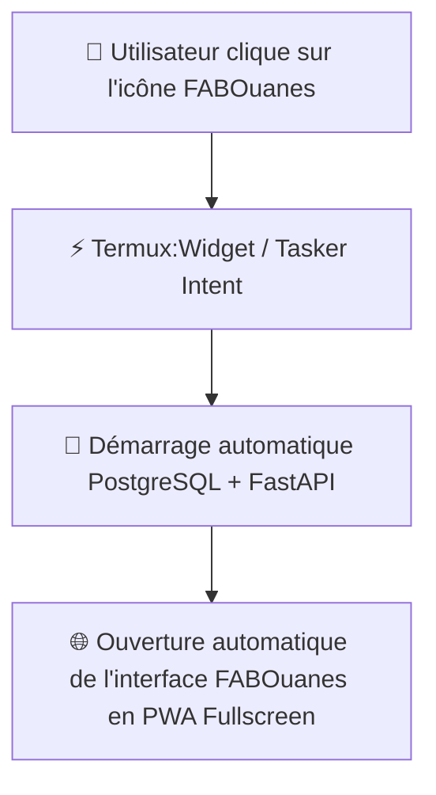

# 📱 Guide Déploiement Android "Zéro IT" — FABOuanes ERP

Ce guide explique comment transformer **FABOuanes ERP** sur Android (Termux) en une **application 100% automatique** pour les utilisateurs sans compétences informatiques ("Zéro IT").

---

## 🎯 Objectif
- L'utilisateur final ne **tape AUCUNE commande**.
- L'utilisateur clique uniquement sur une **icône d'application "FABOuanes ERP"** sur l'écran d'accueil Android.
- Le serveur PostgreSQL et l'application FastAPI se lancent en arrière-plan et l'écran de l'application s'ouvre automatiquement.

---

## 🏗️ Architecture du Lanceur Automatique



---

## 🛠️ Méthode 1 : Raccourci 1-Clic "Termux:Widget" (Recommandé)

### Étape 1 : Installer Termux et Termux:Widget
1. Installez **Termux** (depuis F-Droid).
2. Installez **Termux:Widget** (depuis F-Droid).

### Étape 2 : Exécuter l'installation initiale (Une seule fois par l'admin)
Ouvrez Termux et collez la commande unique :
```bash
curl -fsSL https://raw.githubusercontent.com/ouanesfab-alt/FABouanes/main/setup_termux.sh | bash
```

### Étape 3 : Créer le widget 1-Clic sur l'écran d'accueil Android
Le script d'installation configure automatiquement le dossier `~/.shortcuts/` :
1. Sur l'écran d'accueil d'Android, faites un **appui long** et sélectionnez **Widgets**.
2. Choisissez **Termux:Widget**.
3. Déposez l'icône **`start_fab.sh`** (renommée **FABOuanes ERP**) sur l'écran d'accueil.

👉 **Résultat** : L'utilisateur n'a qu'à toucher ce bouton sur son écran pour démarrer et ouvrir l'application !

---

## ⚡ Méthode 2 : Démarrage 100% Automatique à l'allumage de la Tablette (Termux:Boot)

Avec cette méthode, **l'utilisateur ne touche à rien** : dès que le smartphone ou la tablette Android s'allume, la caisse / ERP démarre seule en arrière-plan.

### Configuration Admin (Fait 1 seule fois) :
1. Installez **Termux:Boot** depuis F-Droid.
2. Lancez **Termux:Boot** une première fois pour lui accorder les autorisations.
3. C'est tout ! Le script `setup_termux.sh` a déjà configuré la séquence de démarrage dans `~/.termux/boot/start_fab_boot.sh`.

👉 **Résultat** : Dès que l'appareil Android s'allume, le serveur s'exécute automatiquement en tâche de fond.

---

## 📲 Méthode 3 : Transformer FABOuanes en Vraie App APK / PWA

Pour que l'expérience soit 100% identique à une application native du Google Play Store :

1. Lancez FABOuanes (via `https://127.0.0.1:5000` ou l'IP Wi-Fi).
2. Dans le navigateur (Chrome / Brave / Edge sur Android), touchez les **3 points en haut à droite**.
3. Appuyez sur **"Ajouter à l'écran d'accueil"** ou **"Installer l'application"**.
4. Une véritable icône d'application **FABOuanes** s'installe avec son propre logo, s'exécutant sans barre d'adresse ni navigation (mode plein écran natif).

---

## 🔒 Résumé pour l'Administrateur
| Action | Réalisé par | Fréquence |
| :--- | :--- | :--- |
| Installation Termux + Script `setup_termux.sh` | Admin | 1 seule fois à la livraison |
| Création du Raccourci / Widget PWA | Admin | 1 seule fois |
| Utilisation quotidienne (Clic sur l'icône) | Utilisateur final | Tous les jours (0 ligne de commande) |
